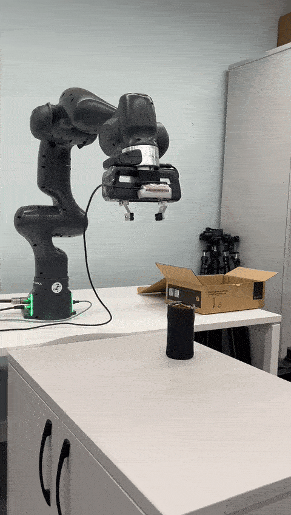

<br>
<br>

**RoboRL Navigator** is a project that offers a codebase for Reinforcement Learning tailored to manipulator robots, particularly the Franka Emika Panda Robot. The project includes both Bullet and ROS Gazebo simulation environments that can be used to train the model to reach a specified pose. It also utilizes an open-source Grasping Pose Detection project that can be tested in either the Gazebo Simulation environment or the Real World.

RoboRL Navigator, already sim-to-real adjustment. Thus, trained models can be tested on
real world.

## Documentation
[](https://GitHub.com/Naereen/StrapDown.js/graphs/commit-activity)
[](https://github.com/Naereen/StrapDown.js/blob/master/LICENSE)
[](https://www.python.org/)
<a href="https://github.com/psf/black"></a>


Documentation is available [here](https://roborl-navigator.readthedocs.io/en/latest/).

## Video

[](https://www.youtube.com/watch?v=CJJvQztncOw)

## Demonstration




## Used By

This project is used by the following groups:

- **CUCR** (Cardiff University Coptutational Robotics Team)


## License

[MIT](https://choosealicense.com/licenses/mit/)


## CodeStyle
Pyink
```shell
python3 -m pyink --line-length 120 -S .
```